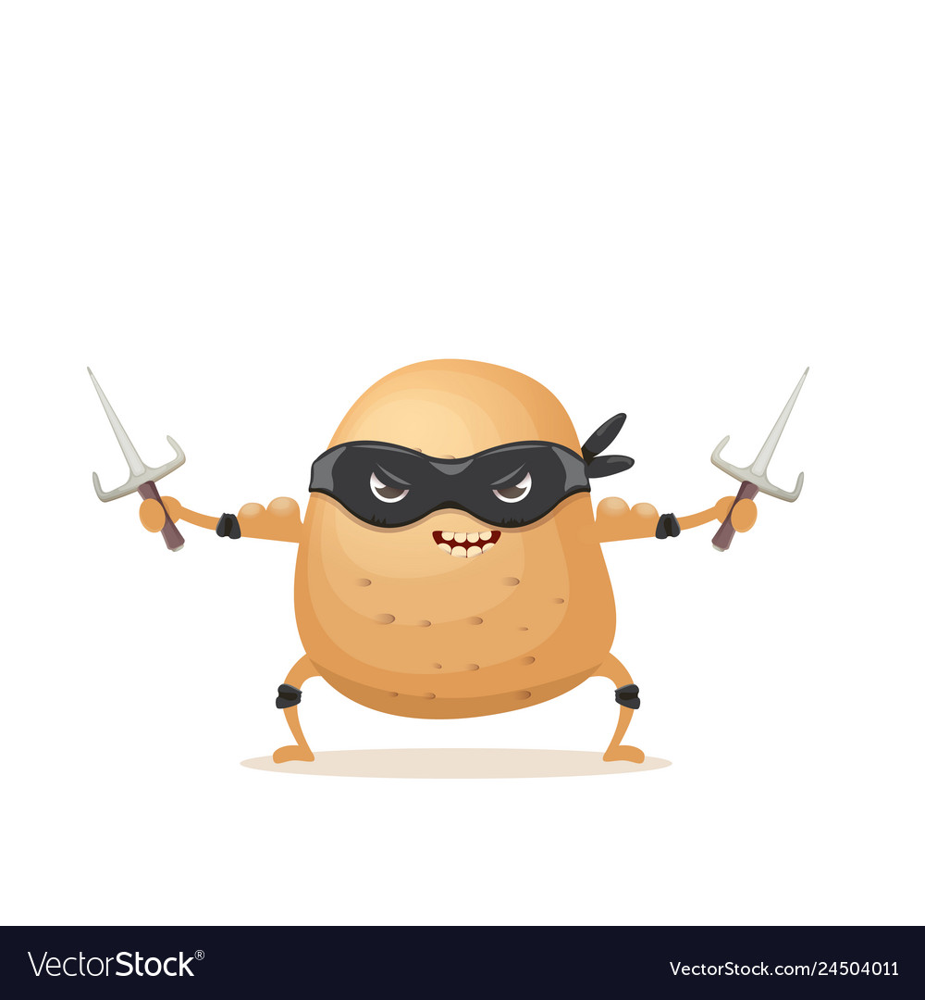

<!--
*** Thanks for checking out this README Template. If you have a suggestion that would
*** make this better, please fork the repo and create a pull request or simply open
*** an issue with the tag "enhancement".
*** Thanks again! Now go create something AMAZING! :D
-->

<!-- PROJECT SHIELDS -->
<!--
*** I'm using markdown "reference style" links for readability.
*** Reference links are enclosed in brackets [ ] instead of parentheses ( ).
*** See the bottom of this document for the declaration of the reference variables
*** for contributors-url, forks-url, etc. This is an optional, concise syntax you may use.
*** https://www.markdownguide.org/basic-syntax/#reference-style-links
-->
[![Contributors][contributors-shield]][contributors-url]
[![Issues][issues-shield]][issues-url]
[![MIT License][license-shield]][license-url]

 

  

  <h3 align="center"> DnD - Dungeons and Dumbledore</h3>

  

     
    <a href="https://github.com/kennethenglisch/cautious-potatos"><strong>Explore the docs »</strong></a>
     
     
    <a href="https://github.com/kennethenglisch/cautious-potatos">View Demo</a>
    ·
    <a href="https://github.com/kennethenglisch/cautious-potatos/issues">Report Bug</a>
    ·
    <a href="https://github.com/kennethenglisch/cautious-potatos/issues">Request Feature</a>
  

<!-- TABLE OF CONTENTS -->
## Table of Contents

* [About the Project](#about-the-project)
  * [Basic Idea](#basic-idea)
  * [Features](#features)
  * [Assets](#assets)
  * [Built With](#built-with)
* [Getting Started](#getting-started)
  * [Prerequisites](#prerequisites)
  * [Installation](#installation)
* [Usage](#usage)
* [Roadmap](#roadmap)
* [Contributing](#contributing)
* [License](#license)
* [Contact](#contact)
* [Acknowledgements](#acknowledgements)

<!-- ABOUT THE PROJECT -->
## About The Project
### Basic Idea
* Genre: 2D Rogue-like
* Story (temp): Death is invading the physical world, and our hero sets out to vanquish him. During his quest, he dies (multiple times) and slowly his goal changes, from saving the world to simply wanting to die (permantly). After Death's defeat, the hero himself takes its place, and the game starts over again, with a new hero at the start.

### Features
* Player Character
* Movement Bindings: WASD, arrow-keys and controller
* Attack Bindings: right and left mouse click
* 3 Enemy types and 1 boss, with a complex AI : enemies might retreat when on low health or they might have sudden bursts of speed
* Dead enemies can be moved around just like the ragdoll physics in Dark Souls
* Player can die
* Pause menu with working resume and main menu button
* Player attacks: Close (with random crit chance) and Ranged
* Animated colliders
* Player and Enemy animations
* UI: Player: health & armor bars, visible stats (damage and speed). Enemy: health bar
* Main menu with working start and exit button
* Pause menu
* Death screen
* Random item drops: 7 types of items for : health, armor, speed. Permanent and not.
* 5 different maps: starting village , boss room and 3 dungeons.
* The order of the 3 dungeons is randomly generated.
* The dungeons are very large, making it very likely that the player needs multiple runs to reach the exit.
* Music: Background, attack and item pichup voice lines.
* Fun gameplay

### Controlls
* Movement: WASD keys, Arrow keys
* Close Attack: left mouse button
* Range Attack: right mouse button
* Pause Menu: ESC key

### Assets
https://assetstore.unity.com/packages/2d/environments/tiny-rpg-town-environment-88293
https://assetstore.unity.com/packages/2d/environments/rogue-fantasy-castle-164725
https://assetstore.unity.com/packages/2d/environments/rogue-fantasy-catacombs-167275
https://assetstore.unity.com/packages/2d/characters/hero-nad-opponents-animation-140776
https://assetstore.unity.com/packages/2d/gui/fantasy-wooden-gui-free-103811
https://assetstore.unity.com/packages/2d/gui/icons/2d-pixel-item-asset-pack-99645
https://assetstore.unity.com/packages/2d/gui/icons/rpg-unitframes-1-powerful-metal-95252
https://luizmelo.itch.io/wizard-pack

### Built With

* [Unity](https://unity.com)
Version: 2019.4.12f1

<!-- GETTING STARTED -->
## Getting Started

### Prerequisites

_Add prerequisites if required_

### Installation

_Add installation steps if required_

<!-- USAGE EXAMPLES -->
## Usage
[Documentation](https://example.com)

<!-- ROADMAP -->
## Roadmap

See the [open issues](https://github.com/kennethenglisch/cautious-potatos/issues) for a list of proposed features (and known issues).

<!-- CONTRIBUTING -->
## Contributing
* Bartholomäus Berresheim
* Kenneth Englisch
* Marie Lencer
<!-- LICENSE -->
## License

Distributed under the MIT License. See `LICENSE` for more information.

<!-- CONTACT -->
## Contact

Project Link: [https://github.com/kennethenglisch/cautious-potatos](https://github.com/kennethenglisch/cautious-potatos)

<!-- MARKDOWN LINKS & IMAGES -->
<!-- https://www.markdownguide.org/basic-syntax/#reference-style-links -->
[contributors-shield]: https://img.shields.io/github/contributors/kennethenglisch/cautious-potatos?style=flat-square
[contributors-url]: https://github.com/kennethenglisch/cautious-potatos/graphs/contributors
[issues-shield]: https://img.shields.io/github/issues/kennethenglisch/cautious-potatos?style=flat-square
[issues-url]: https://github.com/kennethenglisch/cautious-potatos/issues
[license-shield]: https://img.shields.io/github/license/kennethenglisch/cautious-potatos?style=flat-square
[license-url]: https://github.com/kennethenglisch/cautious-potatos/blob/master/LICENSE
